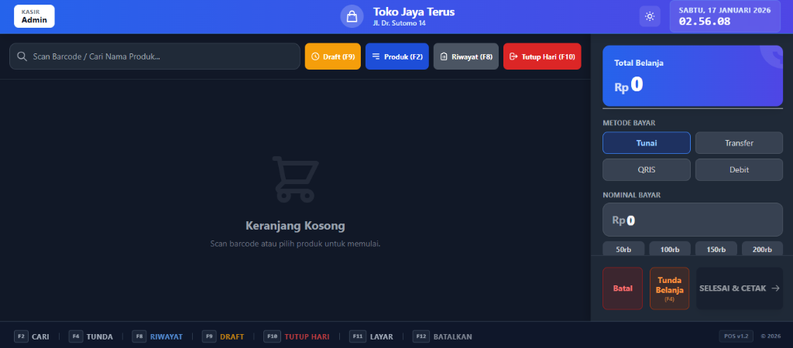
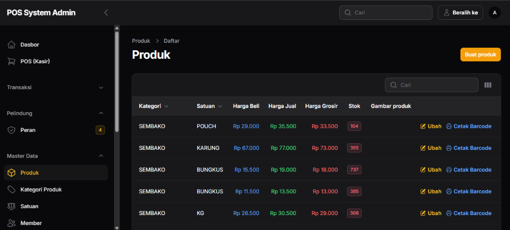

# 🛒 Sistem Point of Sale (POS)

Aplikasi Point of Sale berbasis web yang dibangun dengan **Laravel 11** dan **Filament 4**, dirancang untuk memudahkan pengelolaan transaksi penjualan, inventori, dan administrasi toko.

developed by : Don Borland

## 📋 Daftar Isi

- [Fitur Utama](#-fitur-utama)
- [Teknologi](#-teknologi-yang-digunakan)
- [Instalasi](#-instalasi)
- [Konfigurasi](#-konfigurasi)
- [Struktur Database](#-struktur-database)
- [Penggunaan](#-penggunaan)
- [Screenshot](#-screenshot)
- [Lisensi](#-lisensi)

## ✨ Fitur Utama

### 🏪 Master Data
- **Manajemen Produk**
  - Multi-satuan dengan konversi otomatis (contoh: 1 Dus = 12 Pcs)
  - Support barcode scanning
  - Harga khusus per satuan (eceran, grosir, dll)
  - Tracking stok real-time
  - Kategori produk
  - Upload foto produk

- **Manajemen Member**
  - Sistem kode member otomatis (format: MBR-YYYY-XXXX)
  - Tracking hutang member
  - Pembayaran cicilan hutang
  - Riwayat pembayaran hutang lengkap
  - Tanggal bergabung otomatis

- **Manajemen Supplier**
  - Data supplier dengan informasi kontak lengkap
  - Tracking pembelian per supplier

### 💰 Transaksi

- **POS (Point of Sale)**
  - Interface khusus kasir yang user-friendly
  - Barcode scanning dengan sound effect
  - Kalkulasi otomatis (subtotal, diskon, pajak, kembalian)
  - Multiple metode pembayaran (Tunai, QRIS, Transfer, Debit)
  - Split payment (sebagian tunai + sebagian transfer)
  - Diskon fleksibel (persen atau nominal)
  - Cetak struk otomatis

- **Manajemen Penjualan**
  - CRUD penjualan lengkap
  - Filter berdasarkan tanggal, status pembayaran
  - Export data penjualan
  - Detail transaksi per item

- **Manajemen Pembelian**
  - CRUD pembelian dari supplier
  - Tracking uang muka dan sisa pembayaran
  - Diskon pembelian
  - Auto-update stok setelah pembelian

### 📊 Inventori & Stok

- **Manajemen Stok**
  - Tracking keluar-masuk stok
  - Stok opname
  - Riwayat perubahan stok
  - Alert stok minimum
  - Multiple jenis transaksi (masuk, keluar, retur, opname, penyesuaian)

### 📈 Laporan & Dashboard

- **Dashboard Admin**
  - Statistik penjualan hari ini
  - Grafik trend penjualan
  - Widget "Top 10 Produk Terlaris"
    - Total unit terjual
    - Sisa stok dengan indikator visual
    - Harga jual

- **Laporan Harian**
  - Tutup kasir otomatis
  - Laporan penjualan per periode
  - Export ke PDF
  - Tracking kas masuk/keluar

### 🖨️ Cetak Barcode Label 103

- **Fitur Cetak Barcode**
  - Format label 103 standar undangan (3.2 x 6.4 cm)
  - Layout 3 kolom x 4 baris (12 label per halaman)
  - Single print (1 produk diulang 12x)
  - Bulk print (pilih multiple produk)
  - Output PDF siap cetak
  - Margin presisi sesuai standar label

### ⚙️ Pengaturan

- **Setting Toko**
  - Informasi toko (nama, alamat, telp

on)
  - Upload logo toko
  - Pengaturan pajak default
  - Konfigurasi receipt/struk

## 🛠️ Teknologi yang Digunakan

- **Backend**: Laravel 11
- **Admin Panel**: Filament 4
- **Database**: MySQL
- **Frontend**: 
  - Livewire (untuk POS interface)
  - Alpine.js
  - Tailwind CSS
- **Libraries**:
  - `picqer/php-barcode-generator` - Generate barcode
  - `barryvdh/laravel-dompdf` - Generate PDF
  - Filament Plugins

## 📥 Instalasi

### Prasyarat

- PHP >= 8.2
- Composer
- MySQL/MariaDB
- Node.js & NPM

### Langkah Instalasi

```bash
# Clone repository
git clone <repository-url>
cd pos-app

# Install dependencies
composer install
npm install

# Copy environment file
cp .env.example .env

# Generate application key
php artisan key:generate

# Konfigurasi database di .env
# DB_DATABASE=pos_db
# DB_USERNAME=root
# DB_PASSWORD=

# Jalankan migrasi dan seeder
php artisan migrate --seed

# Build assets
npm run build

# Jalankan aplikasi
php artisan serve
```

## ⚙️ Konfigurasi

### Database Seeder

Setelah migrasi, jalankan seeder untuk data awal:

```bash
php artisan db:seed
```

Seeder akan mengisi:
- User admin default (email: admin@example.com, password: password)
- 6 data member dengan berbagai tingkat hutang
- Kategori produk
- Satuan default
- Data produk sample

### Konfigurasi Locale

Aplikasi menggunakan Bahasa Indonesia sebagai default. Pastikan di `.env`:

```
APP_LOCALE=id
APP_FALLBACK_LOCALE=id
```

### Konfigurasi Filament

Panel admin dapat diakses di `/admin`. Untuk publish translasi plugin:

```bash
php artisan vendor:publish --tag=filament-developer-logins-translations
```

## 🗄️ Struktur Database

### Tabel Utama

- `produks` - Master produk
- `pelanggans` - Data member/pelanggan
- `suppliers` - Data supplier
- `penjualans` - Header transaksi penjualan
- `penjualan_details` - Detail item penjualan
- `pembelians` - Transaksi pembelian
- `stoks` - Riwayat keluar-masuk stok
- `pembayaran_hutang_members` - Riwayat pembayaran hutang member
- `kategoris` - Kategori produk
- `satuans` - Master satuan
- `settings` - Konfigurasi aplikasi

## 🚀 Penggunaan

### Login Admin

1. Akses `/admin`
2. Login dengan kredensial default:
   - Email: `admin@example.com`
   - Password: `password`

### Menggunakan POS

1. Akses `/pos` (setelah login)
2. Pilih member (opsional)
3. Scan barcode atau pilih produk manual
4. Atur jumlah dan satuan
5. Terapkan diskon jika perlu
6. Pilih metode pembayaran
7. Input jumlah bayar
8. Proses transaksi

### Cetak Barcode

1. Buka menu **Produk**
2. Pilih produk yang ingin dicetak barcode
3. Opsi:
   - **Single**: Klik tombol printer di baris produk
   - **Bulk**: Centang beberapa produk → Bulk Action → "Cetak Barcode Label 103"
4. PDF akan terbuka di tab baru
5. Cetak ke printer dengan kertas label 103

### Pembayaran Hutang Member

1. Buka menu **Member**
2. Klik pada member yang memiliki hutang
3. Klik tombol **"Bayar Hutang"** di tabel
4. Input:
   - Jumlah bayar
   - Tanggal pembayaran
   - Metode pembayaran
   - Catatan (opsional)
5. Simpan - hutang akan otomatis berkurang

### Sistem Hutang Member di POS

#### 📌 Cara Kerja Hutang Member

Member/pelanggan tetap memiliki **privilege khusus** untuk melakukan transaksi dengan sistem hutang:

**Tipe Konsumen:**
- **👤 Umum**: Pelanggan biasa - WAJIB bayar lunas
- **⭐ Member**: Pelanggan tetap - BOLEH hutang (full atau sebagian)

**Status Pembayaran:**
| Status | Kondisi | Keterangan |
|--------|---------|------------|
| **Lunas** | Bayar ≥ Total | Tidak ada hutang |
| **Bayar Sebagian** | 0 < Bayar < Total | Hutang = Total - Bayar |
| **Hutang** | Bayar = 0 | Hutang = Total |

#### 💡 Contoh Skenario

**Skenario 1: Member Bayar Sebagian**
```
Total Belanja: Rp 100.000
Bayar: Rp 50.000
Hutang Baru: Rp 50.000
Status: Bayar Sebagian
```

**Skenario 2: Member Full Hutang**
```
Total Belanja: Rp 150.000
Bayar: Rp 0
Hutang Baru: Rp 150.000
Status: Hutang
```

**Skenario 3: Member Bayar Lunas**
```
Total Belanja: Rp 200.000
Bayar: Rp 200.000
Hutang Baru: Rp 0
Status: Lunas
```

#### 🔄 Tracking Hutang Otomatis

- Hutang tersimpan di kolom `hutang` tabel `pelanggans`
- Hutang bersifat **kumulatif** (hutang lama + hutang baru)
- Setiap transaksi member yang tidak lunas otomatis menambah hutang
- Pembayaran hutang akan mengurangi total hutang member

#### 📊 Melihat Hutang Member

**Di Admin Panel:**
1. Buka menu **Pelanggan**
2. Lihat kolom **Hutang**
3. Filter member dengan hutang > 0
4. Klik member untuk detail transaksi

**Di Database:**
```sql
-- Lihat semua member yang punya hutang
SELECT kode_member, nama, hutang 
FROM pelanggans 
WHERE hutang > 0 
ORDER BY hutang DESC;
```

### Barcode Scanner Fisik

Aplikasi mendukung **barcode scanner fisik** (USB/Bluetooth) yang bekerja seperti keyboard:

#### 🔌 Jenis Scanner yang Didukung

- ✅ **USB Barcode Scanner** (plug and play)
- ✅ **Bluetooth Barcode Scanner** (pair seperti keyboard)
- ✅ **Wireless 2.4GHz Scanner** (dengan USB dongle)

#### 📱 Setup Scanner

**USB Scanner:**
1. Colokkan scanner ke port USB
2. Tunggu Windows mendeteksi (otomatis)
3. Scanner siap digunakan

**Bluetooth Scanner:**
1. Nyalakan scanner
2. Tekan tombol pairing
3. Di Windows: Settings → Bluetooth & devices → Add device
4. Pilih scanner dari daftar
5. Scanner siap digunakan

#### 💻 Cara Menggunakan

1. Buka halaman **Produk** atau **POS**
2. Kursor otomatis fokus di field barcode
3. **Scan barcode** dengan scanner fisik
4. Barcode otomatis terisi
5. Tekan **Enter** atau **Tab**

#### ⚙️ Konfigurasi Scanner (Opsional)

**Enter Key Suffix:**
- Scan barcode "Add Enter Suffix" di manual scanner
- Scanner akan auto-tekan Enter setelah scan

**Tab Key Suffix:**
- Scan barcode "Add Tab Suffix" di manual scanner
- Scanner akan auto-pindah ke field berikutnya

#### 💰 Rekomendasi Scanner

| Budget | Model | Harga | Fitur |
|--------|-------|-------|-------|
| **Budget** | Yongli XYL-901 | Rp 150k-300k | USB, 1D barcode |
| **Mid-Range** | Honeywell Voyager 1200g | Rp 300k-500k | USB, 1D, reliable |
| **Premium** | Zebra DS2208 | Rp 800k+ | USB, 2D, QR code |

## 📸 Screenshot

### 🖥️ Interface POS (Kasir)
Interface POS yang modern dan user-friendly dengan fitur barcode scanning, multiple metode pembayaran, dan kalkulasi otomatis.



**Fitur yang terlihat:**
- Search barcode/produk
- Kategori produk (Draft, Produk, Riwayat, Tutup Hari)
- Multiple metode pembayaran (Tunai, Transfer, QRIS, Debit)
- Nominal bayar dengan quick input (50rb, 100rb, 150rb, 200rb)
- Tombol "Selesai & Cetak"
- Total belanja real-time

### 📊 Admin Panel - Manajemen Produk
Panel admin dengan Filament 4 untuk manajemen data produk lengkap dengan multi-satuan dan harga fleksibel.



**Fitur yang terlihat:**
- Daftar produk dengan kategori dan satuan
- Harga Beli, Harga Jual, Harga Grosir
- Stok real-time dengan indikator warna
- Tombol aksi: Ubah dan Cetak Barcode
- Navigasi menu terorganisir (Master Data, Transaksi, Pelindung, dll)


## Panduan Penggunaan Aplikasi POS (e-POS)

Selamat datang di panduan penggunaan aplikasi **e-POS**. Dokumentasi ini disusun untuk membantu Anda memahami alur kerja dan fitur-fitur yang ada di dalam sistem secara rinci sesuai dengan logika yang telah diimplementasikan.

---

### 1. Master Data (Pondasi Sistem)

Sebelum melakukan transaksi, Anda perlu melengkapi data dasar di menu **Master Data**.

#### A. Produk & Inventori

- **Kelola Produk**: Digunakan untuk mendaftarkan barang yang dijual.
  - **Barcode**: Setiap produk wajib memiliki kode barcode unik. Sistem mendukung input manual atau scanner.
  - **Kategori & Satuan**: Mengelompokkan produk (contoh: Makanan, Minuman) dan menentukan satuan dasar (contoh: PCS, BOX).
  - **Satuan Lanjutan (Konversi)**: Fitur khusus untuk produk yang memiliki lebih dari satu satuan. Contoh: 1 Dus berisi 12 Pcs. Anda bisa mengatur harga jual khusus untuk satuan besar.
  - **Harga Beli vs Harga Jual**: Masukkan harga modal (beli) dan harga jual. Sistem akan memvalidasi agar harga jual tidak lebih rendah dari harga beli.
  - **Stok Awal**: Saat membuat produk baru, Anda bisa memasukkan jumlah stok awal.

#### B. Pelanggan & Distributor

- **Pelanggan**: Mencatat data pembeli. Ada dua tipe: **Umum** (tanpa data) dan **Member** (pelanggan tetap).
- **Distributor**: Mencatat data supplier tempat Anda menyuplai barang. Data ini diperlukan saat mencatat transaksi pembelian.

---

### 2. Alur Transaksi Penjualan (Point of Sale)

Menu ini digunakan oleh Kasir untuk melayani pembeli.

1. **Input Barang**: Gunakan scanner pada kolom "Scan Barcode" atau pilih produk secara manual.
2. **Validasi Stok**: Sistem akan menolak jika jumlah barang yang dimasukkan melebihi stok yang tersedia.
3. **Diskon & Pajak**: Anda dapat memberikan diskon dalam bentuk **Persentase (%)** atau **Nilai Rupiah (Rp)**. Sistem juga mendukung perhitungan PPN secara otomatis.
4. **Metode Pembayaran**:
   - **Tunai**: Untuk pembayaran uang tunai. Masukkan jumlah uang bayar untuk menghitung kembalian.
   - **Non-Tunai**: Mendukung Transfer Bank, QRIS, dan Kartu Debit. Anda bisa menginput Nama Bank dan Nomor Ref/Kartu untuk keperluan pelacakan.
5. **Status Transaksi**:
   - **Selesai**: Jika pembayaran lunas.
   - **Pending**: Jika pembayaran belum lunas atau barang dipesan terlebih dahulu.
6. **Cetak Struk**: Setelah transaksi berhasil, Anda dapat mencetak struk belanja untuk pelanggan.

---

### 3. Alur Transaksi Pembelian (Barang Masuk)

Gunakan menu **Pembelian Produk** untuk menambah stok secara resmi dari distributor.

1. **Tambah Pembelian**: Pilih distributor dan tanggal pembelian.
2. **Item Barang**: Masukkan barang-barang yang baru datang beserta harga belinya (jika ada perubahan harga dari supplier).
3. **Logika Stok**: Saat transaksi pembelian disimpan, sistem akan otomatis menambah stok produk di gudang secara real-time.

---

### 4. Manajemen & Riwayat Stok

Sistem ini menggunakan sistem **Kartu Stok** yang mencatat setiap pergerakan barang.

- **Otomatis**: Stok bertambah saat ada **Pembelian** dan berkurang saat ada **Penjualan**.
- **Manual (Koreksi)**: Jika Anda mengedit jumlah stok langsung di menu **Edit Produk** (misal karena ada barang rusak atau luput dari pencatatan), sistem akan mencatatnya sebagai "Penyesuaian Manual" agar sejarah pergerakan barang tetap terlacak.
- **Peringatan Stok**: Produk dengan stok di bawah 5 akan ditandai dengan warna merah (Bahaya), dan di bawah 10 akan berwarna kuning (Peringatan).

---

### 5. Pelaporan & Analisis

Aplikasi menyediakan berbagai laporan untuk memantau performa bisnis:

- **Laporan Penjualan**: Rekap transaksi per periode tertentu. Anda bisa memfilter berdasarkan Kasir atau Shift.
- **Laporan Stok**: Melihat sejarah detail keluar-masuk barang per produk.
- **Tutup Toko (Laporan Harian)**: Digunakan di akhir hari/shift untuk membandingkan total tunai di sistem dengan fisik uang di laci (Rekonsiliasi). Sistem akan menghitung jika ada selisih lebih atau kurang.
- **Ekspor PDF**: Semua laporan dapat diunduh dalam format PDF yang rapi untuk keperluan arsip atau cetak.

---

### 6. Pengaturan Aplikasi

Sesuaikan identitas toko Anda di menu **Pengaturan** atau **Aplikasi**:

- Nama Perusahaan/Toko.
- Alamat & Nomor Telepon (akan muncul di header struk).
- Logo Toko (akan muncul di laporan PDF dan struk).

---

---

### Tips Keamanan & Performa

- Selalu gunakan fitur **Edit Produk** hanya untuk koreksi minor. Untuk penambahan stok rutin, gunakan menu **Pembelian**.
- Pastikan printer thermal dan koneksi scanner sudah teruji sebelum memulai shift.
- Lakukan **Tutup Toko** setiap hari untuk menjaga akurasi data keuangan.

## 🔒 Keamanan

- Authentication menggunakan Laravel Sanctum
- Role-based access control
- CSRF protection
- Password hashing dengan Bcrypt
- XSS protection

## 🤝 Kontribusi

Kontribusi selalu diterima! Silakan:

1. Fork repository
2. Buat branch fitur (`git checkout -b feature/AmazingFeature`)
3. Commit perubahan (`git commit -m 'Add some AmazingFeature'`)
4. Push ke branch (`git push origin feature/AmazingFeature`)
5. Buat Pull Request

## 📝 Changelog

### Version 1.1.0 (Latest)

- ✅ **Sistem Hutang Member Lengkap**
  - Member bisa hutang (full atau sebagian)
  - Tracking hutang otomatis dan kumulatif
  - Status pembayaran: Lunas, Bayar Sebagian, Hutang
  - Pembayaran hutang dengan riwayat lengkap
  - Validasi: Pelanggan Umum wajib bayar lunas

- ✅ **Barcode Scanner Fisik**
  - Support USB, Bluetooth, dan Wireless 2.4GHz scanner
  - Plug and play - bekerja seperti keyboard
  - Tidak perlu kamera atau HTTPS
  - Instant scanning (<0.5 detik)
  - Dokumentasi setup lengkap

- ✅ **Perbaikan Tutup Hari**
  - Fix error "Tidak ada transaksi penjualan untuk ditutup"
  - Perhitungan tunai vs non-tunai dari tabel pembayarans
  - Laporan PDF otomatis terdownload

- ✅ **Fitur Tutup Toko Otomatis**
  - Menutup toko secara otomatis pada pukul 23:59 WIB.
  - Mengubah status toko di pengaturan menjadi "Tutup".
  - Mencatat riwayat penutupan di `store_statuses`.
  - **Cara Setup:**
    - **Development:** Jalankan `php artisan schedule:work`.
    - **Production:** Tambahkan cron job `* * * * * php /path-to-project/artisan schedule:run >> /dev/null 2>&1`.

### Version 1.0.0

- ✅ Sistem POS dengan barcode scanning
- ✅ Manajemen produk multi-satuan
- ✅ Sistem member dengan tracking hutang
- ✅ Pembayaran hutang dengan riwayat lengkap
- ✅ Widget Top 10 produk terlaris
- ✅ Cetak barcode label 103
- ✅ Laporan harian dan tutup kasir
- ✅ Format nominal dengan pemisah ribuan
- ✅ Translasi Indonesia lengkap

## 📄 Lisensi

Aplikasi ini adalah open-source software dilisensikan di bawah [MIT license](https://opensource.org/licenses/MIT).

## 📞 Kontak & Support

Untuk pertanyaan, bug report, atau request fitur, silakan buat issue di repository ini.

---

**Dikembangkan dengan ❤️ menggunakan Laravel & Filament**
